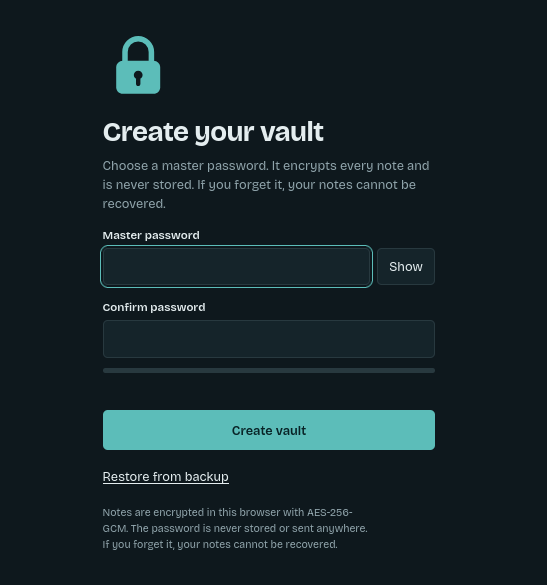
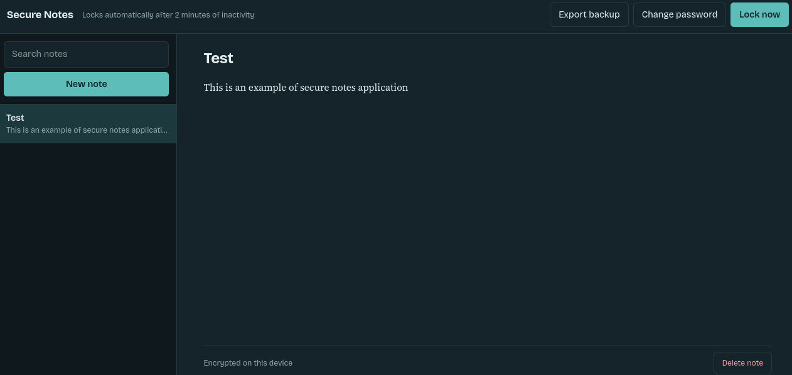

# Secure Notes

A private notes app that runs entirely in your browser. Notes are encrypted with a master password before they are saved, so nobody who gets access to the stored data (or this GitHub repository) can read them.

**Live demo:** https://7zt4.github.io/secure-notes/

## Screenshots

**Create your vault** (first use)



**Notes view** (after unlocking)



## Features

- Master password set on first use (never stored anywhere)
- Create, edit, search and delete notes, with autosave
- Auto-lock after 2 minutes of inactivity, plus a "Lock now" button
- Password strength meter and minimum length check
- Export and restore an encrypted backup file
- Change master password (all notes are re-encrypted)
- Slow-down after repeated wrong passwords
- Light and dark theme, keyboard accessible, works on mobile
- No server, no tracking, no third-party libraries

## How the encryption works

| Part | Choice | Why |
|------|--------|-----|
| Key derivation | PBKDF2-HMAC-SHA256, 600,000 iterations | Makes each password guess slow for an attacker |
| Salt | Random 16 bytes per vault | Stops precomputed (rainbow table) attacks |
| Cipher | AES-256-GCM | Encrypts and detects tampering, so a wrong password or edited data fails to decrypt |
| IV / nonce | Random 12 bytes, new on every save | AES-GCM must never reuse an IV with the same key |
| Key storage | Non-extractable `CryptoKey`, memory only | The key disappears when the vault locks or the tab closes |
| Stored data | One encrypted blob in `localStorage` | Titles and the number of notes are hidden too |

All cryptography uses the browser's built-in Web Crypto API (`crypto.subtle`).

Other safeguards:

- User text is always inserted with `textContent`, never `innerHTML`, which prevents XSS.
- A Content Security Policy limits the page to its own script and blocks network requests.
- On lock, decrypted notes are cleared from the page and from memory.

## Limitations

- Notes live in one browser on one device. Use **Export backup** to move or save them.
- There is no password recovery. A forgotten password means the notes are gone.
- Clearing site data deletes the vault, so keep a backup.
- The wrong-password slow-down is stored in the browser and can be bypassed by someone with direct access to it. The real protection against guessing is the slow key derivation and a strong password.
- Malware or a malicious browser extension on the device can read notes while the vault is unlocked.

## Project structure

```
secure-notes/
├── index.html   page structure
├── style.css    styling (light and dark)
├── app.js       encryption and app logic
└── README.md
```

## Run locally

```bash
cd secure-notes
python -m http.server 8000
```

Then open http://localhost:8000. The Web Crypto API needs HTTPS or localhost.

## Author

**7zt4** ([github.com/7zt4](https://github.com/7zt4))
